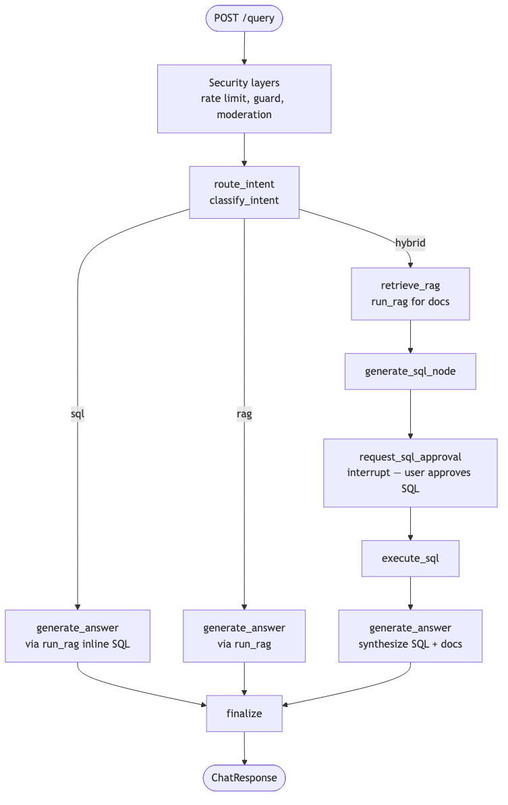
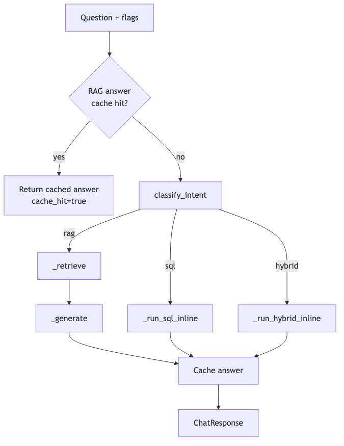
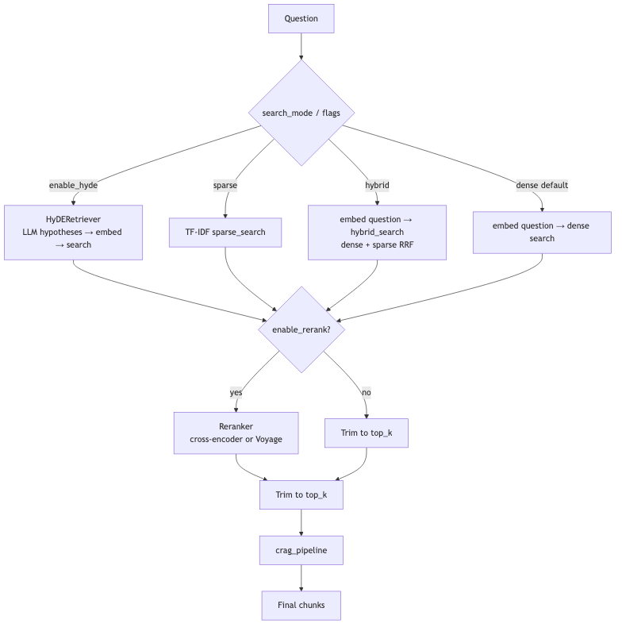
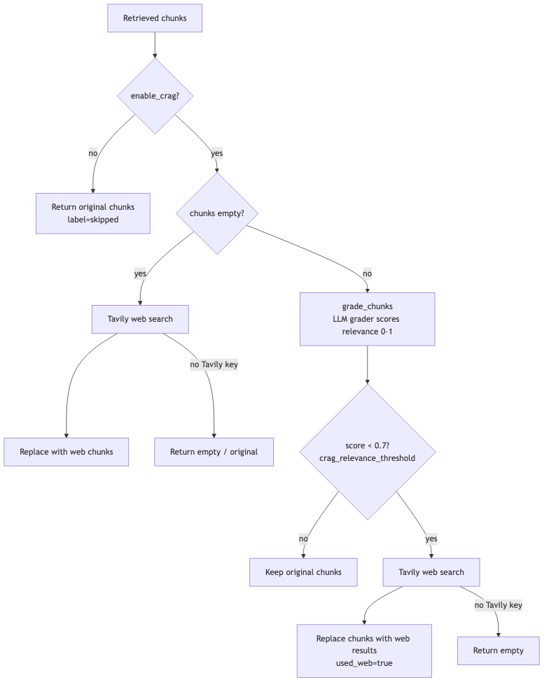
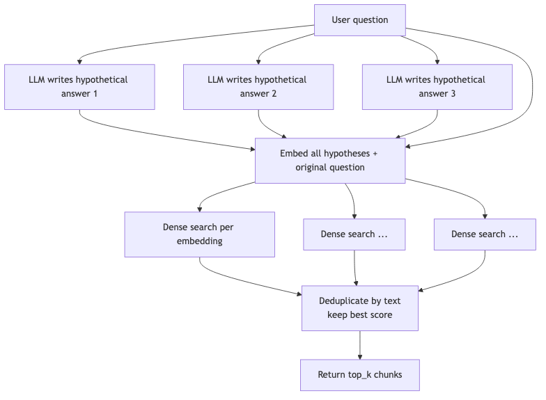
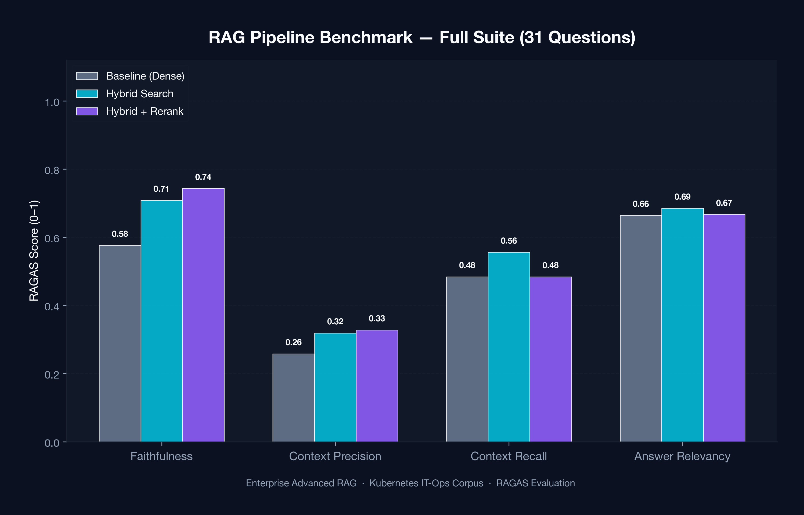
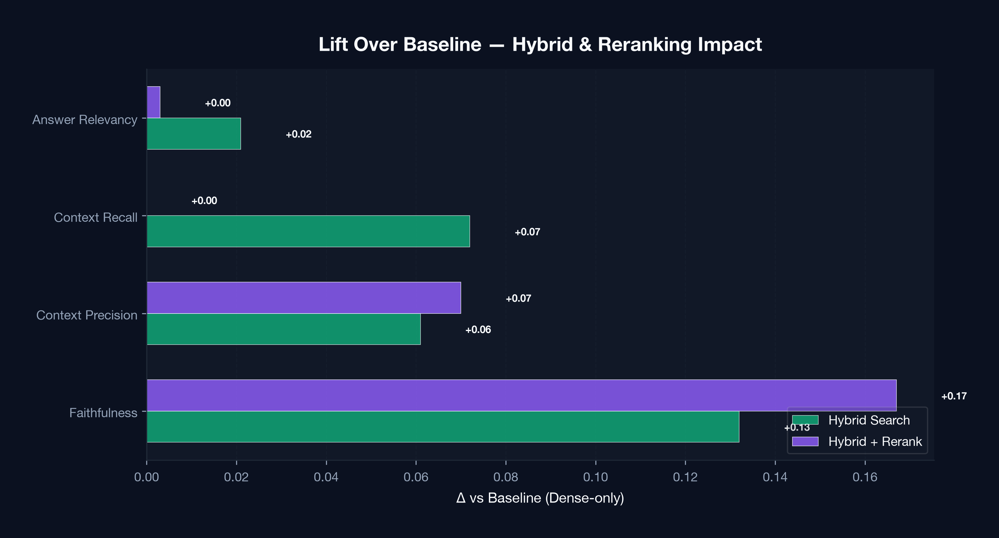
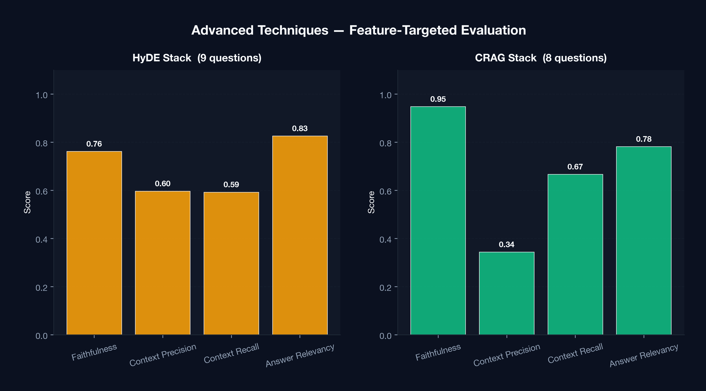

# DeepOps-Query

DeepOps query is a  Kubernetes operations assistant built for platform teams. 

Most RAG prototypes work beautifully on clean questions and curated PDFs. Real platform engineers don't ask clean questions. They ask "why is my app crash-looping?" not "explain CrashLoopBackOff." They want the pod count from yesterday's incident table, not a paragraph from the docs. Sometimes they ask about a tool that isn't in your corpus at all. DeepOps-Query is built for that.

**▶ [Watch the demo](https://drive.google.com/file/d/191VEjHzvVd-c4xkl6TcPb1xv-ObCDObE/view?usp=sharing)** : walkthrough of the Streamlit UI, retrieval toggles, Text2SQL approval flow, and eval dashboard.

---

## What It Does

DeepOps-Query is a single place to ask about pods, deployments, incidents, and runbooks. It routes each question to the right source — documentation, a live database, or the web — and synthesizes one coherent answer.

- **Docs and runbooks** live in Qdrant (~26k chunks from official Kubernetes docs plus the kind of noisy inherited PDFs every platform team actually has) . I have included the noisy dataset to simulate real world scenarios and to check if the retriever can pull the right docs from the corpus. 
- **Ops data** (incident tables, metrics, pod counts) lives in Postgres, queried through a Text2SQL layer
- **LangGraph** handles routing: pure RAG, pure SQL, or a hybrid that retrieves context and queries the database before synthesizing a response

---

## How Retrieval Works

You can toggle retrieval techniques on and off and experiment with different featues.

| Technique | What it does |
|---|---|
| Dense search | Semantic similarity via embeddings |
| BM25 | Keyword-based sparse retrieval |
| Hybrid RRF | Fuses dense and sparse scores |
| Cross-encoder reranking | Re-scores top candidates for precision |
| HyDE | Generates a hypothetical answer to improve query embedding |
| CRAG | Detects bad retrieval and falls back to web search |
| Self-RAG | Reflects on its own output before returning |

Every configuration is evaluated with a RAGAS harness (faithfulness, context precision, context recall, answer relevancy) against a golden dataset: so you can actually compare techniques instead of just assuming hybrid is better.

---

## Safety and Access Control

Every request passes through an LLM security layer before anything else runs. This is one of the most important components of the project, I wanted to ensure the app was safe and trustworthy. Every request is authenticated with the JWT and late goes through: 

- Prompt injection scanning and moderation on all inputs
- Rate limits and per-request token budgets
- SQL is **SELECT-only** — no writes, no DDL
- Hybrid flows (RAG + SQL) require **explicit human approval** before a query hits the database

---

## Stack

Runs entirely locally via Docker Compose. No external dependencies to reproduce benchmarks.

- **Qdrant** — vector store for documents and runbooks
- **Postgres** — structured ops data
- **FastAPI** — backend API
- **Streamlit** — UI to chat, toggle retrieval features, and inspect eval results


---

## Highlights

| Area | What it does |
|------|----------------|
| **Retrieval** | Dense, sparse (BM25), hybrid RRF, cross-encoder reranking, HyDE |
| **Corrective RAG** | Grades retrieved chunks; falls back to Tavily web search when the corpus is irrelevant |
| **Self-RAG** | Reflects on draft answers and regenerates when confidence is low |
| **Text2SQL** | Vanna + Postgres for ops queries (`pods`, `incidents`, …) with **human-in-the-loop SQL approval** |
| **Hybrid intent** | Combines live SQL results with retrieved runbook context in one answer |
| **Security** | LLM-Guard injection scan, toxicity checks, PII redaction, rate limits, per-user token budgets |
| **Caching** | Upstash Redis for embeddings, RAG answers, intent, and SQL |
| **Evaluation** | 40 golden questions, RAGAS metrics, profile-based ablation (`make eval-hybrid`, etc.) |
| **UI** | Streamlit chat with feature toggles and an eval results dashboard |

---

## Architecture

Every query enters through FastAPI, passes security middleware, then routes via **LangGraph** based on intent:

<p align="center">
  
</p>

**Three paths:**

- **RAG** — retrieve from Qdrant, generate with spotlighted context
- **SQL** — Vanna generates `SELECT`-only queries against ops tables
- **Hybrid** — retrieve docs *and* propose SQL; user approves before execution, then the answer synthesizes both

The RAG path itself is modular — each technique can be turned on independently:

<!-- <p align="center">
  
</p> -->

<p align="center">
  
</p>

### Feature deep-dives

**CRAG (Corrective RAG)** — when retrieved chunks don't match the question, grade them and fall back to web search instead of hallucinating from bad context.

<p align="center">
  
</p>

**HyDE** — for vague or layman questions with zero K8s vocabulary, generate hypothetical documents and embed those for retrieval.

<p align="center">
  
</p>


---

## Benchmark results

Evaluated with **RAGAS** on a golden set of Kubernetes ops questions against a seeded Qdrant corpus (~26k chunks). Each profile isolates one retrieval upgrade at a time.

### Full-suite comparison (31 RAG questions)

<p align="center">
  
</p>

| Profile | Faithfulness | Context precision | Context recall | Answer relevancy |
|---------|:-----------:|:-----------------:|:--------------:|:----------------:|
| Baseline (dense) | 0.58 | 0.26 | 0.48 | 0.66 |
| Hybrid search | 0.71 | 0.32 | 0.56 | 0.69 |
| Hybrid + rerank | 0.74 | 0.33 | 0.48 | 0.67 |

**Takeaway:** hybrid retrieval gives the biggest lift on faithfulness (+0.13 over baseline). Reranking adds another bump on precision-sensitive questions.

### Lift over baseline

<p align="center">
  
</p>

### Advanced techniques (feature-targeted evals)

HyDE and CRAG were tested on their dedicated question subsets — these numbers aren't apples-to-apples with the full 31-question suite, but they show where each technique shines.

<p align="center">
  
</p>

| Profile | Questions | Faithfulness | Notes |
|---------|:---------:|:------------:|-------|
| HyDE stack | 9 | 0.76 | Bridges vocabulary gaps ("my app keeps restarting" → deployment docs) |
| CRAG stack | 8 | 0.95 | Web fallback rescues out-of-corpus / post-training questions |

Regenerate charts after new eval runs:

```bash
make eval-charts
```

---

## Tech stack

| Layer | Tools |
|-------|-------|
| API | FastAPI, Uvicorn |
| Orchestration | LangGraph + Postgres checkpointing |
| Vector DB | Qdrant |
| Embeddings | OpenAI `text-embedding-3-small` |
| Reranker | `cross-encoder/ms-marco-MiniLM-L-6-v2` (local) or Voyage |
| Text2SQL | Vanna + Postgres |
| Doc parsing | Docling (PDF, DOCX, HTML, TXT) |
| Cache | Upstash Redis |
| Security | LLM-Guard, custom moderation, JWT auth |
| Web fallback | Tavily |
| Eval | RAGAS, custom golden-set harness |
| UI | Streamlit |
| Infra | Docker Compose (Postgres, Qdrant, app) |

---

## Quick start

### Prerequisites

- Python 3.12, [uv](https://docs.astral.sh/uv/)
- Docker Desktop (for Postgres + Qdrant)
- API keys: OpenAI (required), Upstash Redis (caching), Tavily (CRAG web fallback)

### Setup

```bash
git clone <your-repo-url>
cd DeepOps-Query

cp .env.example .env
# Edit .env — at minimum set OPENAI_API_KEY and JWT_SECRET

make install          # create venv + install deps
docker compose up -d  # postgres, qdrant, API on :8000
make seed             # migrations, demo users, ingest docs → Qdrant
make streamlit        # UI on :8501
```

**Demo logins:** `agent@demo.local` / `agent123` · `admin@demo.local` / `admin123`

> If Docker's `app` service is running on `:8000`, don't also run `make api` — you'll get a port conflict. Use one or the other.

### Try a query

Open Streamlit, log in, and ask something like:

- *"What is a Pod in Kubernetes?"* → RAG over docs
- *"How many pods are in Failed status?"* → Text2SQL (with approval flow for hybrid queries)

Toggle retrieval features in the sidebar: hybrid search, reranking, HyDE, CRAG, self-reflective generation.

---

## Evaluation

Run ablation profiles individually or generate benchmark charts:

```bash
make eval-baseline   # dense-only baseline
make eval-hybrid     # hybrid retrieval
make eval-rerank     # hybrid + cross-encoder rerank
make eval-hyde       # HyDE + baseline questions
make eval-crag       # CRAG + baseline questions
make eval-all        # full stack enabled
make eval-charts     # PNG charts → docs/benchmarks/
```

Results land in `eval/results/` (gitignored). Charts for the README live in `docs/benchmarks/`.

---

## Security model

Queries pass through layered checks before reaching the LLM:

1. **Input restructuring** — truncate oversized prompts
2. **LLM-Guard** — prompt injection, ban-topics, toxicity
3. **Content moderation** — regex PII redaction on input (no over-aggressive NER)
4. **Rate limiting** — per-user sliding window + daily token budget
5. **Output moderation** — structured PII redaction on responses

SQL execution is **SELECT-only** and requires explicit user approval in the hybrid path.

---

## Project layout

```
app/
  api/           # FastAPI routes (auth, query, admin)
  core/          # LangGraph state machine
  services/      # RAG, CRAG, HyDE, reranking, SQL, embeddings, …
  security/      # Guards, moderation, spotlighting
  middleware/    # JWT auth, rate limiting
eval/
  seed_questions.yaml   # 40 golden eval questions
  profiles.py           # retrieval feature profiles
  generate_charts.py    # benchmark visualizations
scripts/
  streamlit_app.py      # chat UI + eval dashboard
  seed_db.py            # DB migrations + doc ingestion
seed/
  docs/                 # true_data/ + noisy_data/ corpora
  migrations/           # Postgres schema
images/                 # architecture diagrams
docs/benchmarks/        # RAGAS chart PNGs
```


---

## License

MIT

---

## Acknowledgements

I'm grateful to the teams behind the open-source tools that make **DeepOps-Query** possible: **LangGraph**, **RAGAS**, **Qdrant**, **Docling**, **LLM-Guard**, **Vanna**, and **Tavily**. The Kubernetes documentation corpus and community runbooks served as the knowledge base for ingestion and evaluation.

If you're exploring advanced RAG beyond notebook demos, I hope this repo saves you some dead ends. Feedback and issues are welcome.
